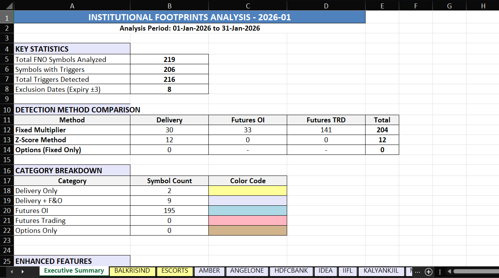
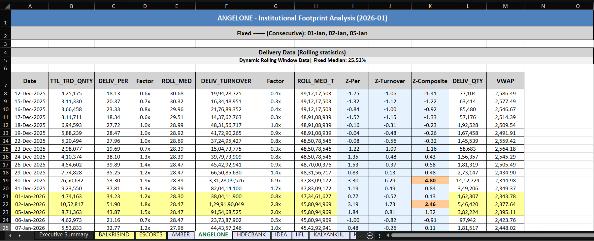

# NSE Institutional Swing Strategy

**Full-Stack Swing Trading System for NSE F&O**  
*Detecting institutional footprints using delivery, futures & options data*


**⚠️ Confidentiality Notice:** To protect trading logic, signal parameters, and custom statistical models, the code has been structurally redacted. 

## 📌 Executive Summary
This project automates the end-to-end ingestion, cleaning, and analysis of raw, daily exchange data. It processes gigabytes of historical and daily tick/EOD data through custom mathematical models to filter out market noise and identify statistically significant market behavior. The final output is a completely automated, dynamic Excel dashboard used to streamline daily research and positional trading decisions.

## 🧠 Core Quantitative Frameworks

The system operates on two distinct, proprietary detection models designed to capture different profiles of market participant behavior across the derivatives segment:

### 1. Strategy S (Event-Driven Detection)
* **Objective:** Identifies isolated, statistically significant anomalies in market participation.
* **Mechanism:** Processes delivery metrics, futures Open Interest (OI), and options pricing across multiple expiries.
* **Engineering Focus:** Built to dynamically handle missing datasets, calculate custom Volume Weighted Average Prices (VWAP) on the fly, and execute complex cross-instrument data merges without pipeline failure.

### 2. Strategy X (Sustained Flow Tracking)
* **Objective:** Detects continuous, multi-day shifts in market structure.
* **Mechanism:** Utilizes custom-built rolling statistical windows and volatility-adjusted thresholds to identify sustained deviations from historical norms.
* **Engineering Focus:** Heavily utilizes vectorized `pandas` and `numpy` operations to calculate advanced statistical metrics across large datasets efficiently, actively filtering out expiry-week volatility and zero-volume anomalies.

## 🛠️ Technical Architecture & Data Engineering

* **Automated Data Ingestion:** Safely extracts, parses, and cleans nested CSVs directly from compressed daily exchange ZIP archives.
* **Data Cleansing & Validation:** Dynamically handles market holidays, missing data points, and dynamically calculates complex exclusion dates (e.g., ignoring specific trading days relative to rolling derivative expiries).
* **Statistical Engine:** Replaces standard loop-heavy analysis with vectorized operations, ensuring the pipeline remains highly performant even as the dataset scales.

## 📊 Automated Reporting & Visualization
Instead of relying on raw terminal outputs or basic CSVs, the pipeline utilizes `xlsxwriter` to automatically generate comprehensive, interactive trading dashboards.
* **Algorithmic Categorization:** Automatically sorts and categorizes equities into distinct worksheets based on the type and quality of the generated signal.
* **Conditional Formatting Heatmaps:** Generates dynamic, color-coded matrices for instant visual triage of complex statistical outputs.
* **Automated Data Visualization:** Programmatically injects localized line charts directly alongside the data tables to map price action against signal generation points.

## 📈 Sample Output Dashboards

### Executive Summary Aggregation

**Strategy S Summary:**


**Strategy X Summary:**



### Symbol Deep-Dives & Heatmaps

**Strategy S Signal:**


**Strategy X Signal:**


## 💻 Technology Stack
* **Language:** Python
* **Data Processing & Math:** `pandas`, `numpy`
* **System & File Management:** `os`, `zipfile`, `datetime`, `re`
* **Automated Reporting:** `xlsxwriter`
  
### 🚀 Why this stands out
- Fully reproducible & auditable pipeline  
- Handles real institutional data flows (delivery + F&O)  
- Professional-grade reporting that looks like a quant desk tool  
- Demonstrates strong Python + data engineering skills applied to trading

## 📁 Project Structure
The repository is modularized to separate data pipelining, statistical engines, and reporting:
* `src/data_pipeline.py`: Handles ZIP/CSV extraction, cleaning, and VWAP calculations.
* `src/strategy_engine.py`: Contains the vectorized rolling statistics and Z-score mathematics.
* `src/report_generator.py`: Manages the XlsxWriter dashboard creation and automated charting.

### 🔗 Related Project
**Audited Real-Money Intraday Trading Performance**  
→ [trading_report](https://github.com/ombhojwani11/trading_report)  
(₹1.20L realized profit | 2,409 trades | Max drawdown 3.3% | Fully reproducible audit)

## 🛠️ Setup & Execution
> **Note:** Because the core proprietary multipliers and algorithmic entry criteria have been redacted from `strategy_engine.py`, this repository serves as an architectural template and will not execute trades or generate the full dashboards out-of-the-box. 

To view the dependency structure or run the base data pipeline framework locally:

```bash
git clone https://github.com/ombhojwani11/NSE-Institutional-Swing-Strategy.git
cd NSE-Institutional-Swing-Strategy
pip install -r requirements.txt

